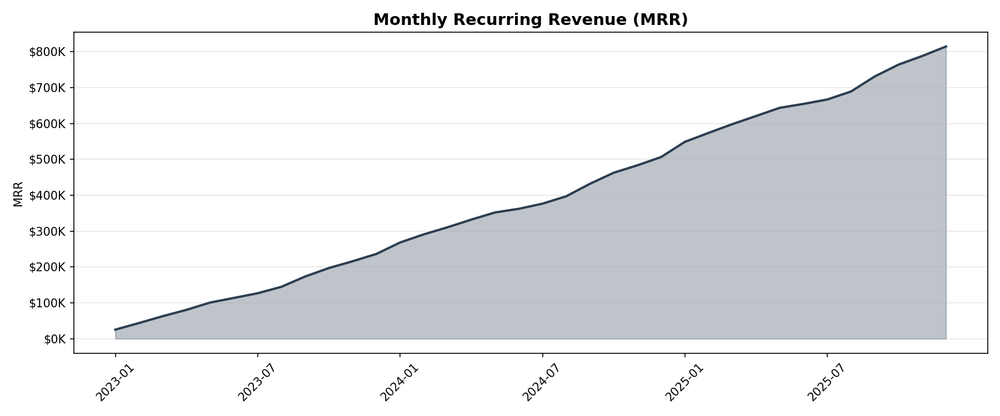
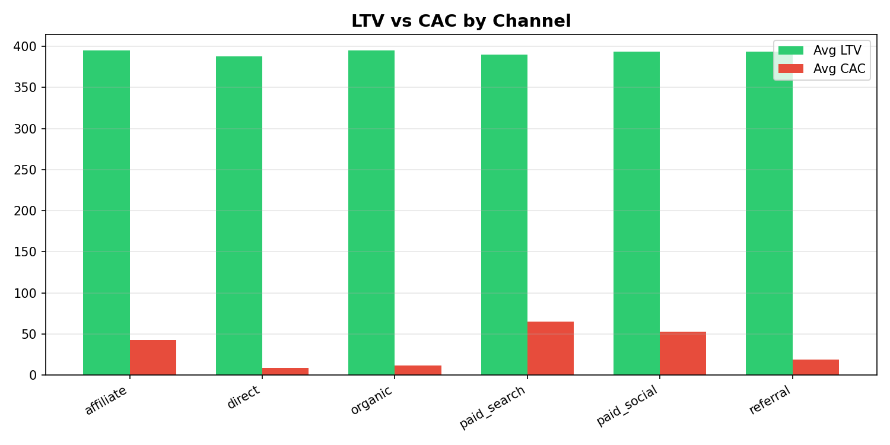
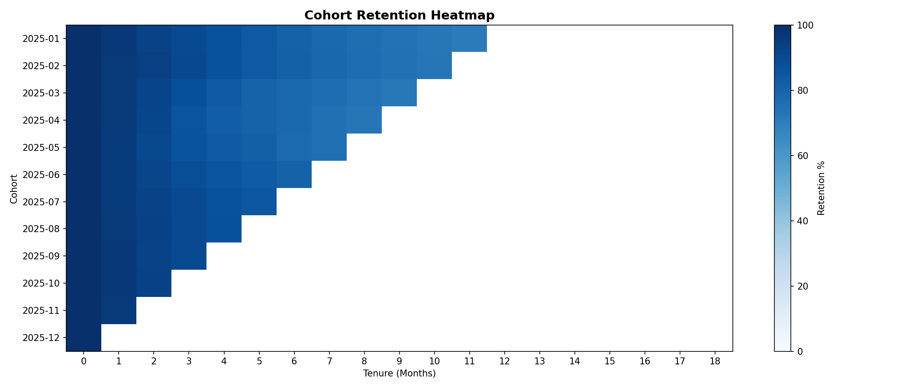
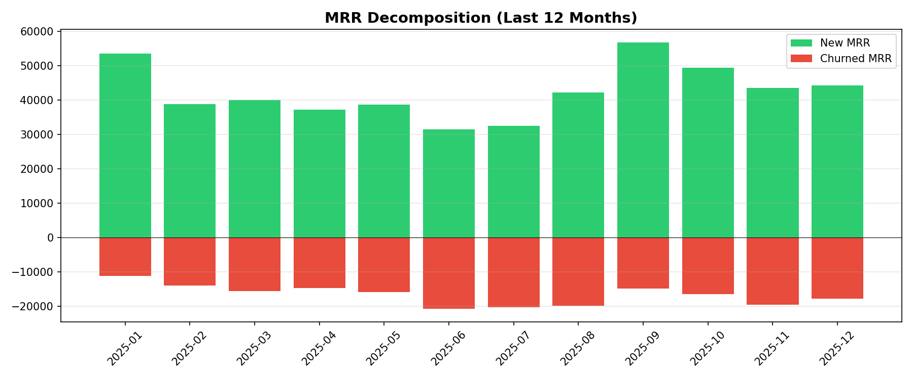

# Subscription Financial Model

**[Live Interactive Dashboard](https://nicholasjh-work.github.io/subscription-financial-model/)**

Driver-based financial analytics for a DTC membership business built on real subscription data from the KKBox music streaming platform (WSDM Kaggle Competition, 6.7M members, 21.5M transactions). Covers MRR decomposition, cohort retention, LTV/CAC unit economics, plan mix analysis, engagement-churn correlation, and forward MRR forecasting.

## Why This Exists

This project demonstrates what a Business Analytics Manager (Finance) delivers at a subscription company: connecting operational drivers (acquisition, retention, monetization) to financial projections with enough rigor to defend in executive planning sessions. Every analysis maps to a real decision: where to allocate marketing spend, which plan types to promote, how engagement predicts churn, and what the forward revenue trajectory looks like.

## Architecture

```
KKBox (Kaggle) ─► setup.sh ─► PostgreSQL ─► dbt models ─► Python analysis ─► Streamlit
                                  │
                  Marketing       │
                  enrichment ─────┘
                  (synthetic)
```

```
subscription-financial-model/
├── setup.sh                         # One-command setup: download, load, enrich
├── data/
│   ├── raw/                         # KKBox CSVs (downloaded by setup.sh)
│   ├── generate_enrichment.py       # Synthetic marketing spend layer
│   └── marketing_spend.csv          # Generated enrichment data
├── models/
│   ├── staging/
│   │   ├── sources.yml              # Raw table definitions
│   │   ├── stg_members.sql          # Clean demographics, map channels
│   │   ├── stg_transactions.sql     # Parse dates, derive plan type, compute MRR
│   │   └── stg_user_logs.sql        # Daily engagement metrics
│   └── marts/
│       ├── fct_mrr_summary.sql      # MRR decomposition with growth metrics
│       ├── fct_cohort_retention.sql  # Monthly retention by cohort + channel
│       ├── fct_ltv_cac_by_channel.sql # Unit economics per acquisition channel
│       ├── fct_plan_mix.sql         # MRR contribution by plan type
│       └── fct_engagement_churn.sql # Engagement tier vs churn rate
├── analysis/
│   └── financial_analytics.py       # Query layer with mart/raw fallback
├── dashboard/
│   └── app.py                       # Streamlit dashboard (6 tabs)
├── screenshots/                     # Static charts for README
├── dbt_project.yml
├── profiles.yml.example
├── .env.example
└── requirements.txt
```

## Data Sources

### KKBox (Real Data)

| Table | Rows | Description |
|-------|------|-------------|
| `members` | 6.7M | Member demographics: age, gender, city, registration date, registration method |
| `transactions` | 21.5M | Payment events: plan days, list price, actual paid, auto-renew, expiry, cancellation |
| `user_logs` | 30M | Daily engagement: songs played by completion bucket, unique songs, total seconds |
| `train` | 970K | Churn labels for Feb/Mar 2017 expiry cohorts |

### Marketing Spend (Synthetic Enrichment)

KKBox does not publish marketing spend data. This layer generates realistic channel-level spend calibrated against industry benchmarks (streaming CAC $3-40, blended $8-25, marketing as 15-25% of revenue) to enable LTV/CAC and capital allocation analysis.

## Analytics Modules

| Module | Business Question | Key Output |
|--------|-------------------|------------|
| **MRR Decomposition** | How is recurring revenue growing? | New, expansion, contraction by month |
| **Cohort Retention** | Are we retaining members better over time? | Retention heatmap by cohort and tenure |
| **LTV / CAC** | Which channels generate the best unit economics? | LTV/CAC ratio and payback by channel |
| **Plan Mix** | How is our revenue composition shifting? | MRR % by plan type over time |
| **Engagement vs Churn** | Does engagement predict churn? | Churn rate by engagement tier |
| **MRR Forecast** | What does the next 6 months look like? | Driver-based trailing growth projection |

## Screenshots

### MRR Over Time


### LTV / CAC by Channel


### Cohort Retention Heatmap


### MRR Decomposition


## Quick Start

### Prerequisites
- Python 3.10+
- PostgreSQL 14+
- Kaggle CLI (`pip install kaggle`)
- Kaggle API credentials (~/.kaggle/kaggle.json)

### Setup

```bash
git clone https://github.com/nicholasjh-work/subscription-financial-model.git
cd subscription-financial-model
pip install -r requirements.txt
cp .env.example .env  # Edit with your PostgreSQL credentials

# One-command setup: downloads KKBox data, creates schema, loads CSVs
chmod +x setup.sh
./setup.sh

# Build dbt models
cp profiles.yml.example ~/.dbt/profiles.yml
dbt build

# Launch dashboard
streamlit run dashboard/app.py
```

### Without PostgreSQL (Quick Demo)

The analysis module falls back to CSV if PostgreSQL is unavailable:

```bash
python data/generate_enrichment.py  # Generate marketing spend CSV
# Dashboard will show enrichment data only (limited without KKBox)
```

## dbt Models

### Staging

| Model | Source | Key Transformations |
|-------|--------|-------------------|
| `stg_members` | `raw.members` | Age outlier cleanup (10-80), date parsing, channel mapping |
| `stg_transactions` | `raw.transactions` | Date parsing, plan type derivation, MRR normalization |
| `stg_user_logs` | `raw.user_logs` | Date parsing, completion rate, minutes calculation |

### Marts

| Model | Grain | Description |
|-------|-------|-------------|
| `fct_mrr_summary` | month | MRR with new/expansion/contraction decomposition, ARPU, growth % |
| `fct_cohort_retention` | cohort_month x tenure x channel | Retention rate at each tenure month |
| `fct_ltv_cac_by_channel` | acquisition_channel | LTV, CAC, ratio, payback months |
| `fct_plan_mix` | month x plan_type | MRR and % contribution by plan |
| `fct_engagement_churn` | engagement_tier | Churn rate correlated with daily usage intensity |

## Tech Stack

PostgreSQL, dbt, Python, pandas, SQLAlchemy, Streamlit, Plotly, matplotlib

Production target: Snowflake (profiles.yml.example includes Snowflake config)

## Related Repos

- [feature-adoption-retention](https://github.com/nicholasjh-work/feature-adoption-retention) - Feature engagement and retention cohorts (dbt + Snowflake)
- [fpna-forecasting-model](https://github.com/nicholasjh-work/fpna-forecasting-model) - Driver-based revenue forecasting
- [llm-text-to-sql-finance](https://github.com/nicholasjh-work/llm-text-to-sql-finance) - Governed NL-to-SQL for finance teams

## Author

**Nicholas Hidalgo** - [nicholashidalgo.com](https://www.nicholashidalgo.com) | [LinkedIn](https://www.linkedin.com/in/nicholashidalgo/)
